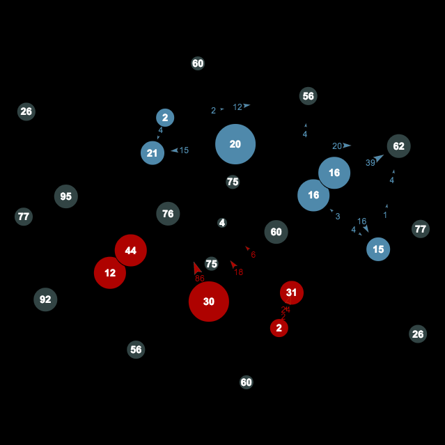

In which I discover python and kick butt.

#### Description

[Planet Wars](http://planetwars.aichallenge.org/) was the 3rd of a [series](http://aichallenge.org/)
of AI programming competitions organized by the University of Waterloo Computer
Science Club and sponsored by Google.
This was the first time programming really clicked for me!
Unfortunately they've stopped hosting competitions but I'll always look back on it fondly.

In planet wars competitors must command fleets of ships around a small planetary system.
Any planets you own create ships for you at a rate proportional to their size.
Neutral (grey) planets don't create ships until they've been captured by either side.
This simple game play mechanic lead to some really interesting things!

#### Code

My first foray into python and boy is it ugly! Looking at is now I'm really surprised I did well.
I guess hard work and enthusiasm count for a lot. If really want to take a look you can find the code
[here](https://github.com/bovard/planet-wars).

One of the most interesting things I did was implement the ant colony optimization and
artificial bee colony algorithms. Ultimately I didn't end up using these as they didn't
perform that well when a single ship could make the difference between victory and defeat.

#### Results

I came in [79th](http://planetwars.aichallenge.org/profile.php?user_id=8475) out of 4600 working entries.

###### Written 03/20/2014