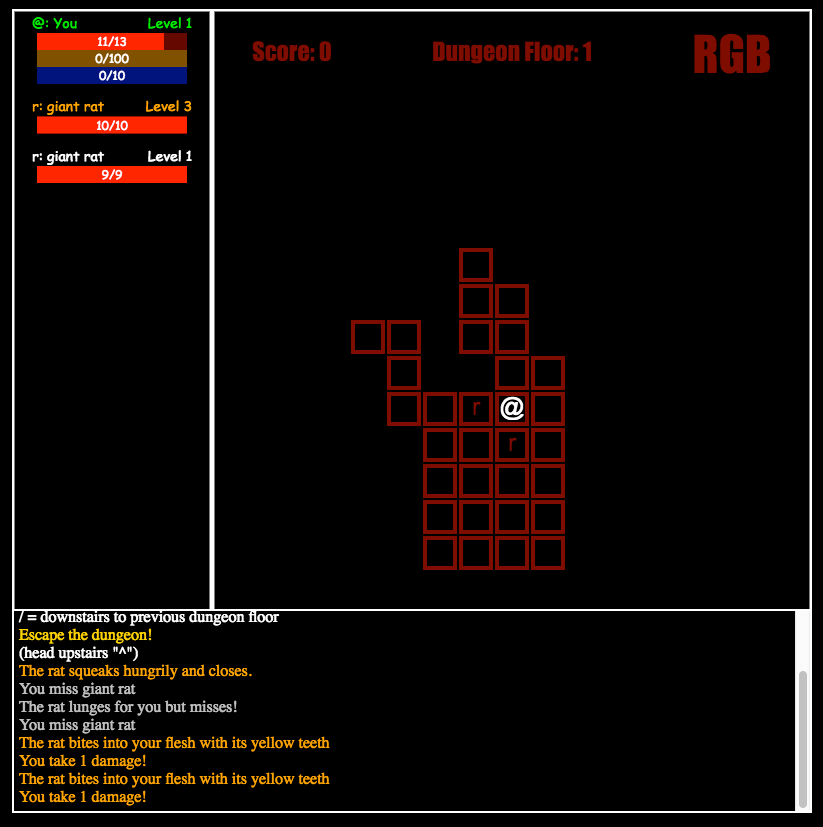
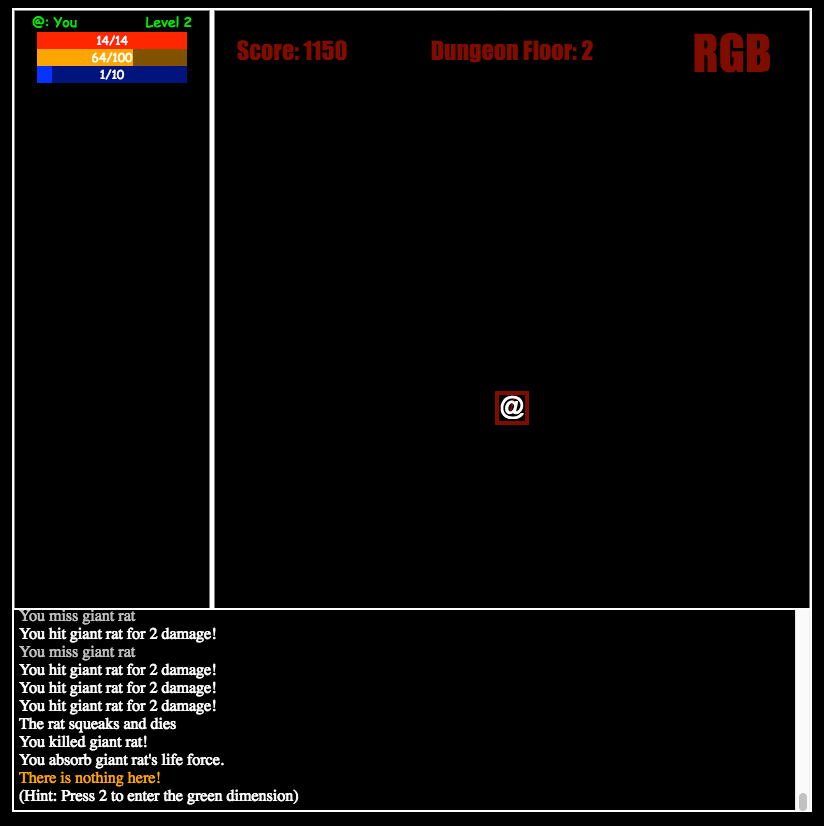
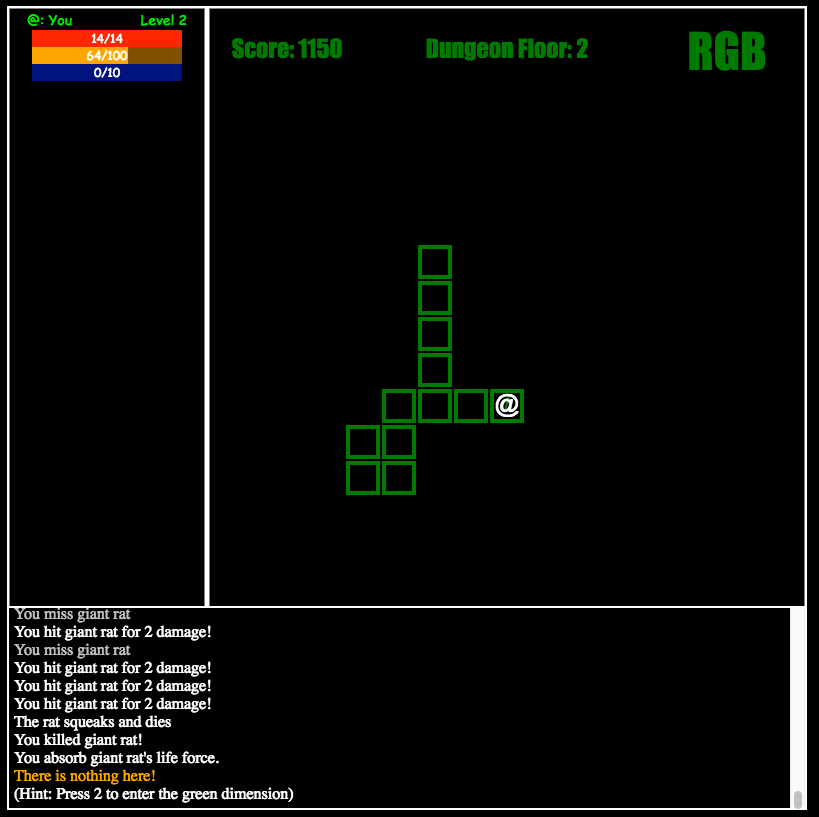
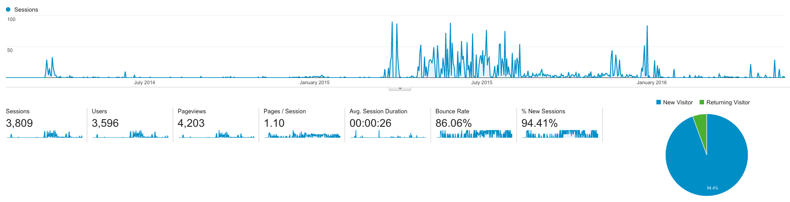

In which I finish my first game

<span class="more"><span>

#### Description

The Seven Day Roguelike challenge ([7DRL](http://www.roguebasin.com/index.php?title=Seven_Day_Roguelike_Challenge)) has been an annual competition since around 2005. The premise is simple: create a roguelike game in seven days! 

From [wikipedia](https://en.wikipedia.org/wiki/Roguelike): 
>Roguelike is a subgenre of role-playing video games characterized by a dungeon crawl through procedurally generated game levels, turn-based gameplay, tile-based graphics, and permanent death of the player-character.

I, like many developers before me, have a long history of half-started games stretching back to middle school (our half-finished Pokemon clone on the TI-83+ was legendary) so the concept of actually finishing something was very appealing to me. I teamed up with a friend and we were off!


*Gotta love those rats*

Our idea was somewhat simple: create a simple dungeon crawler in which you could shift between three dimensions (red, green, blue - hence the name of the game). Initially we were thinking you could gain experience in a dimension for staying in it longer but in the end we made it so that each dimension had its own "special move".


*Our helpful hint to switch dimensions*

It's not the most beautiful or robust (there is a still a bug when going to the next level that I haven't figured out yet) game in the world, but we made it in seven days! From scratch. Take a [crack at it now](http://bovard.github.io/rgb/)! If you get to level 10, consider yourself an RGB champion.


*You're green!*

#### Code

RGB is played in your browser and uses a combination of html element and canvas to render. We wrote everything from scratch, including the game engine, which was quite the learning experience. You can view the code [on github](https://github.com/bovard/rgb).

The encapsulation wasn't the best, [Game.js](https://github.com/bovard/rgb/blob/master/src/Game.js) touches rendering, creep ai, input, game logic, and display but I think it was pretty decent for seven days of work.

Perhaps some of the most gnarly code came when we implemented [Dijkstra's algorithm](https://en.wikipedia.org/wiki/Dijkstra%27s_algorithm) to help our creeps move a little more intelligently. You can see our very simplistic creep ai here:

```javascript
    takeCreepTurn: function(creepController, dijk, closeQuartersDijk) {
        // attack logic if we are in this dimension
        if (creepController.isAdjacentToHero()) {
            creepController.attackHero();
        } else if(creepController.aggroHero()) {
            // Prioritize closeQuartersDijk if it has information
            var next = closeQuartersDijk.getNextTile(creepController.getCharacter().getLocation());
            if (!next) {
                next = dijk.getNextTile(creepController.getCharacter().getLocation());
                if (next)
					console.log("Dikj is telling me to go to", next.toString(), 'from', creepController.getCharacter().getLocation().toString());
            }
            else {
				if (next)
					console.log("closeQtrDikj is telling me to go to", next.toString(), 'from', creepController.getCharacter().getLocation().toString());
            }
			if (next) {
				var dir = creepController.getCharacter().getLocation().directionTo(next);
				if (creepController.canMove(dir)) {
					creepController.move(dir);
				} else {
					// Dijkstra should never tell the creep to move where it can't BUT just in case it does
					this.doBestAdjacentMove(creepController);
				}
			} else {
				this.doBestAdjacentMove(creepController);
			}
        }
```

You can see we borrowed heavily from [battlecode's api](http://www.battlecode.org/) with `creepController` and `canMove`. Had I actually made a `creepPlayer` things might have been much cleaner (and different creeps could have different ai / behaviors).

#### Results

RGB was a success (by 7DRL standards)! We were even featured as the [7DRL of the Day](https://www.reddit.com/r/roguelikes/comments/216bwe/7drl_of_the_day_day_7_rgb/) on reddit and was reviewed a couple times in the [7DRL Reviews](http://7drl.roguetemple.com/Reviews) (thanks to Jabberwock and Yeti for taking the time!) and given an overall score of 2.2 (out of 3)

> "RGB is a browser roguelike with an interesting multi-dimensional mechanic. Red Green and Blue all operate as separate dimensions of the same dungeon. After the first three levels, where switching is mostly useless and/or instant death, the mechanic becomes very interesting! You can only attach enemies in your same dimension, but you can use other dimensions to escape. The level colors are a bit over-bearing but the dimension switching is cool!" - Yeti

Over the years RGB has seen surprisingly more play than I expected. I'm not sure who was playing everyday in the summer of 2015, but whoever you are, I salute you! We've had players from 48 states (North Dakota and Alaska, looking at you) and there have been close to 4000 sessions in the two years since.



###### Written 05/24/2016


