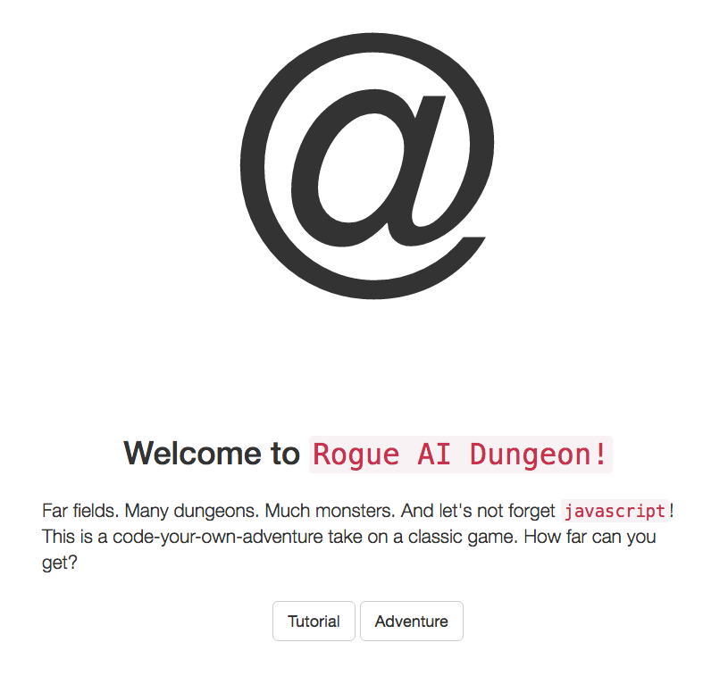
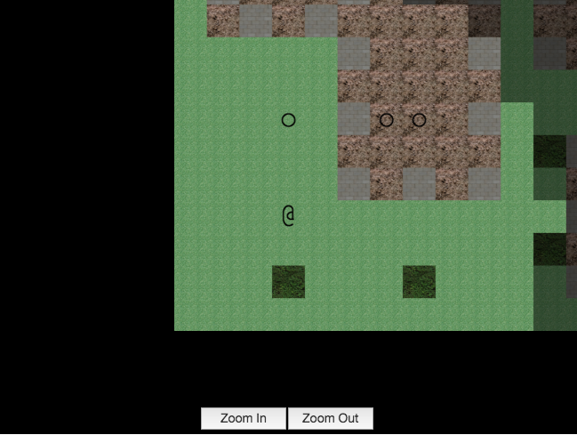

In which I create an AI challenge

<span class="more"><span>

#### Description

The Seven Day Roguelike challenge ([7DRL](http://www.roguebasin.com/index.php?title=Seven_Day_Roguelike_Challenge)) has been an annual competition since around 2005. The premise is simple: create a roguelike game in seven days! 

From [wikipedia](https://en.wikipedia.org/wiki/Roguelike): 
>Roguelike is a subgenre of role-playing video games characterized by a dungeon crawl through procedurally generated game levels, turn-based gameplay, tile-based graphics, and permanent death of the player-character.

I had participated in the 7DRL 2014 challenge, creating [RGB](/articles/rgb/) with a friend. This year I was back with a team of four and we were ready to take on a bit more.

I had been mulling around the idea for a while of making a single-player [battlecode](/articles/battle_code_2013/)-ish challenge. A lot of complexity in battlecode is around messaging a coordination. I figured that if you just controlled one unit you could drop a lot of the complexity. It might also serve as a good starter for students interested in participating in battlecode.


*RAID's splash screen, courtesy of Raph*

We were able to complete (most) everything in a week and called it RAID - Rogue AI Dungeon. The purpose of the game is to program an AI to play the game for you. You'll notice significantly more polish and depth than in RGB. If you're interested in battlecode or learning javascript, [give it a whirl](http://bovard.github.io/raid/)!


*The dreaded orc level!*

#### Code

The first few days of the project I spend duplicating (and adding to) the [battlecode api](http://www.battlecode.org/). We then spent a while on a tutorial which takes you up from the really dumb default player:

```javascript
function RaidPlayer(playerController) {
  this.pc = playerController;
}

RaidPlayer.prototype = {
  act: function() {
    var direction = Direction.randomDirection();
    if(this.pc.canMove(direction)) {
      this.pc.move(direction);
      return;
    }
  }
};
```
through most of the basic API functionality including:
```javascript
senseDirectionToExit();
canMove(direction);
canMeleeAttack(location);
meleeAttack(location);
canMagicAttack(location);
magicAttack(location);
canRangedAttack(location);
rangedAttack(location);
```

I replicated many of the battlecode [game objects](https://github.com/bovard/raid/tree/master/lib/GameObjects) such as [Direction](https://github.com/bovard/raid/blob/master/lib/GameObjects/Direction.js) and [MapLocation](https://github.com/bovard/raid/blob/master/lib/GameObjects/MapLocation.js) and in general things should look very familiar to battlecode veterans. You can find all the code on [github](https://github.com/bovard/raid).

Learning from the past mistakes of RGB, we really did make an effort to separate concerns and I think it turned out quite nicely. We have a sweet canvas renderer that even has animations and were able to program quite a few different behaviors for monsters. As you progress through the levels enemies getting faster, stronger and smarter. 

We also implemented somewhat robust analytics this year so I can tell you that no one has made it past level 11 (of a possible 40). We probably have a few balance issues to work out, but with over 10 AIs playing nearly 50 creep types that's to be expected. Hopefully I'll be able to spend some time balancing on a later date.

#### Results

RAID was a success in 7DRL, earning a [1.9](http://7drl.roguetemple.com/Reviews) (out of 3) from our reviewers, Winter Wolf and Tiger (big thank you!). Tiger writes:

> "This is a game for a programmers only. Luckily, I am a programmer and many of the roguelike players too. In the game, you must write a JavaScript function that controls player so he can reach from one corner of screen to opposite. You can use three different attacks (melee, ranged and magical) to kill several types of monsters,  heal yourself, check a tiles and units around you and move in 8 directions. Early levels are pretty dull, so even A* would be a huge overkill here, simple moving to an exit and snippets copied from tutorial about "if you can hit with magic, do it" are enough to pass first 5 levels. Well, later on levels gets harder and perhaps better tactical AI or at least magic instead of melee could have helped against jackals pack right at start. But testing it would be a pain because you must pass all the levels from first after each failure and it takes about 15 minutes at maximum speed. And if we speak about pathfinding, i don't think i'm in a mood to recreate an a*\wave algorithm in javascript for now. But i'll try to do it later."

Thanks to a little bit of shameless self-promotion on reddit, we had over 3000 sessions in the first week after release! I had certainly never dreamed of such a reception and I was blown away. Some people even contacted us with suggestions and made pull requests to fix some of our bugs! If you want to chat about the game, you can come find us in our [gitter channel](https://gitter.im/bovard/raid).

Overall I couldn't have been happier with the result. Hope you enjoy!

###### Written 05/24/2016


